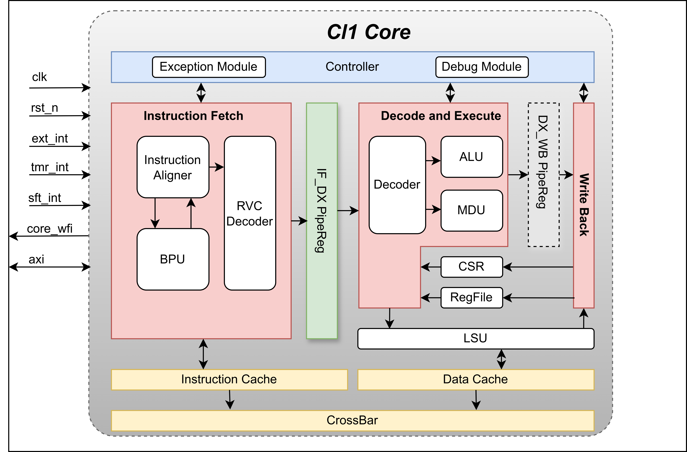

Overall Architecture
====================

CL1 Core is an in-order, single-issue, three-stage RV32IMC_Zicsr processor
core.  The main pipeline stages are instruction fetch, decode/execute, and
writeback.  The design connects multi-cycle memory access, multiply/divide,
CSR, exception, debug, and WFI power-control functions around that ordered
commit point.

   CL1 Core architecture.

The high-level hierarchy is:

.. code-block:: text

   CL1Top
     |
     +-- CL1Core
         |
         +-- CL1IFStage -- FetchAlign -- IBus/CoreBus
         +-- CL1BPU
         +-- CL1IDEXStage -- CL1ALU
         |                 -- CL1MDULp
         |                 -- CL1LSU -- DBus/CoreBus
         +-- CL1WBStage
         +-- CL1RegFile
         +-- CL1CSR
         +-- CL1EXCP
         +-- CL1DM
         +-- CL1PowerCtrl
         +-- optional CL1ICACHE/CL1DCACHE/Crossbar/AXI bridge

The core can be generated with two external bus shapes.
When ``EXPOSE_CORE_BUS=true``, instruction and data access leave the core as
native ``CoreBus`` interfaces named ``ibus`` and ``dbus``.
When ``EXPOSE_CORE_BUS=false``, the instruction and data paths pass through the
optional cache subsystem and are merged into an AXI4 master interface.

The top-level control inputs are common to both interface shapes: clock, reset,
machine interrupt inputs, debug request, boot address, and optional
verification or differential-test outputs.
